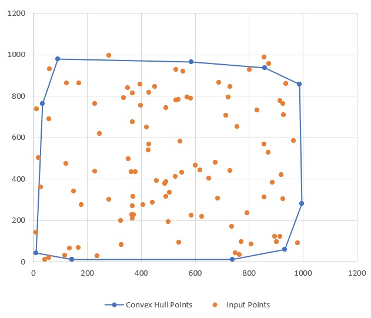

# Convex-Hull
### Algorithm and Data Structures/Honors Project: Created by [Dr. Alxendra Stefan](http://ranger.uta.edu/~alex/)

## Description
This program implements Graham's scan for convex hall of a set of points. Given a set of points-Q, the convex hall of Q is a polygon 'P' such that any point from Q is either on P or inside it.

## Functionality
* Implements Graham's scan to compute convex hall - [convex_hull_graham_scan.c](https://github.com/yxu1183/Convex-Hull/blob/master/convex_hull_graham_scan.c). 
* The program gets the input data from a file [random.txt](https://github.com/yxu1183/Convex-Hull/blob/master/random.txt) generated by [random.c](https://github.com/yxu1183/Convex-Hull/blob/master/random.c). 
* It can either read from the file, or can read from the keyboard combined with redirection of input.
* Generates random points as directed by the user - [random.c](https://github.com/yxu1183/Convex-Hull/blob/master/random.c).
* Time complexity formula for all methods in the code is mentioned in the comments.
* Vertices of the convex hall are plotted in the [microsoft excel](https://github.com/yxu1183/Convex-Hull/blob/master/Convex_hull_plot.xlsx) sheet using [input_points.txt](https://github.com/yxu1183/Convex-Hull/blob/master/input_points.txt) and [convex_hull_points.txt](https://github.com/yxu1183/Convex-Hull/blob/master/input_points.txt).
* [input_points.txt](https://github.com/yxu1183/Convex-Hull/blob/master/input_points.txt) contains all the input points and [convex_hull_points.txt](https://github.com/yxu1183/Convex-Hull/blob/master/convex_hull_points.txt) contains all the vertices of the convex hull points, both generated by [convex_hull_graham_scan.c](https://github.com/yxu1183/Convex-Hull/blob/master/convex_hull_graham_scan.c).

## Implementation
Convex hull implementation using excel sheet:


## Compilation Instructions
The application is built in an omega server at UTA.

To generate the random coordinate points with size of 100 and of range(0 - 1000), in terminal:
```
gcc -o rand random.c
rand 100 1000
```
To compute the convex hall by reading in the from the file [random.txt](https://github.com/yxu1183/Convex-Hull/blob/master/random.txt), in terminal:
```
gcc convex_hull_graham_scan.c
./a.out < random.txt
```
To compute the convex hall by redirection of input from the keyboard, in terminal:
```
gcc convex_hull_graham_scan.c
./a.out
```
To check for memory leaks and error, in terminal:
```
gcc convex_hull_graham_scan.c
valgrind --leak-check=full ./a.out < random.txt
```

## Author
[Yunika Upadhayaya](https://github.com/yxu1183) - *Student ID: 1001631183*

